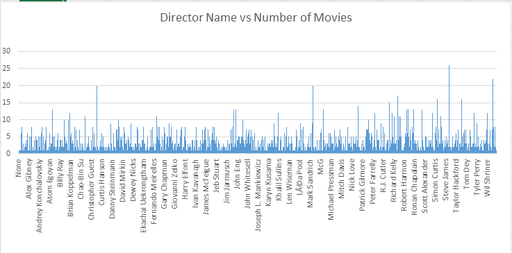
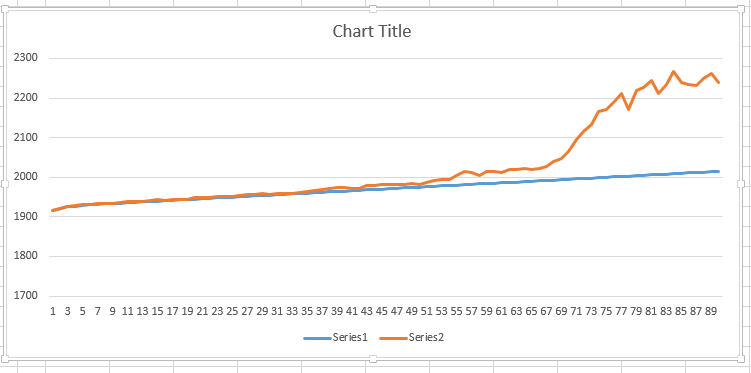

# DIS-MapReducer-Project---P06

### Team Members 

  - Mahesh babu Kadiyala
  - Sai Karthik mandalapu

Northwest Missouri State University
44-564 Design of Data Intensive Systems

## Overview

  - We done two mapreduce problems those include finding the number of movies directed by individual director
  - 2nd problem:
  - finding number of movies released in a particular year

### Describe your data source
  
  - We selected a movies dataset, that includes movie director, actor, release year titile.

#### Link to your original data source: 
  
  - https://www.kaggle.com/deepmatrix/imdb-5000-movie-dataset
  
#### What makes it a big data problem? (Use the Vs of Big Data)
Volume:  Volume of the data set is 2.2 MB. There are 5000 records.
Variety:  It is a structured data. Data is stored in text file
Velocity:  This is historical training data that covers to 1906 and 2015
Veracity:  Data is formatted/cleaned and it is trustworthy
Value:  The weekly sales for holidays week is much higher than non-holidays week

#### Map Reduce problems in the format "for each _(key)_ , we will find the _(value)__".


#### Mapper input:  show one line of data that your mapper will read.
```sh
Color	James Cameron	178	CCH Pounder	Avatar 	2009 
```

#### Sample Mapper output / Reducer input:

| Director | movie_title |
| -------- | ------------|
|A. Raven Cruz	 |  The Helix... Loaded  | 
|Aaron Hann	 |  Circle  |
|Aaron Schneider  | 	Get Low  | 
|Aaron Seltzer	|  Date Movie |
|Abel Ferrara	|  The Funeral  | 
|Adam Brooks	|  "Definitely, Maybe "  |
|Adam Carolla	|  Road Hard  | 
|Adam Goldberg	|  I Love Your Work | 
|Adam Green	|  Hatchet  | 
|Adam Jay Epstein	|  Extreme Movie  | 
|Adam Marcus	|  Jason Goes to Hell: The Final Friday | 
|Adam McKay	Anchorman 2:  |  The Legend Continues  | 
|Adam McKay	Anchorman:   |  The Legend of Ron Burgundy  | 
|Adam McKay	  |  Step Brothers  |

#### sample Reducer output:
|Director | num of movies |
| -------- | ------------|
|A. Raven Cruz  |	1  |
|Aaron Hann	  |   1   |      
|Aaron Schneider  |	 1  |
|Aaron Seltzer	|  1  |
|Abel Ferrara	|  1  |
|Adam Brooks	|  1  |
|Adam Carolla	|  1  |
|Adam Goldberg	|  1  |
|Adam Green	 |  1  |
|Adam Jay Epstein	|  1  |
|Adam Marcus	|  1  |
|Adam McKay	  |  6  |
|Adam Rapp	|  1  |
|Adam Rifkin	|  2  |
|Adam Shankman	|  8  |
|Adrian Lyne	|  4  |
|Adrienne Shelly	|  1  |


- Import this repo to your Github.
- Clone from your Github down to your local computer, e.g. C:\44564\P06.


problem 1: finding number of movies directed bby a particular directory
      Director            Numof Movies
Ex: Christopher Nolan          8

Problem 2: finding number of movies in a particular year

Ex:        year         number of movies 
           2015               224
		   
##### Steps to Execute Mapper and Reducer code:
	
  - STEPS TO WORK ON OUR MAPREDUCE PROBLEM:
  - Step1:- Go to the link provided, it takes to my repository. It is a public repository so anyone can access it.
  - Step2:- Click on clone or download button.
  - Step3:- Copy the web URL(link) to clone our MapReduce problems and all code files to your local machine.  All files are cloned to your local machine

##### STEPS TO RUN MAPREDUCE PROBLEM LOCALLY:
  - Step1:- raw data is in movie_metadata.txt file, My Mapper code is in mapper.py file, mapper output in mapper_output.txt file and you get sorted mapper output from sortedMapper_output.txt file.
  - Step2:- My Reducer code is in reducer.py file and you can get reducer output from result.txt file.
  - Step3:- Right click inside that repository folder and select open command window here as administrator.
  - Step4:- Type command "python mapper.py" and press enter to run that file, you can see output.
  - step5:- Type command" python reducer.py" to see the reducer output( in result.txt file)
  - step6: commands to be execute:
  - python mapper.py
  - python reducer.py
  - if you are running in hadoop the command is: hs mapper.py reducer.py sortedMapper_output result   
  - (sortedmapper_output.txt file in sortedMapper_output directory and result.txt file will be created in result directory)
  
  
##### Image for Reducer_1 Output



##### Image for reducer2 Output



  
  
  ## Resources and References

How to add "Open Command Window Here as Administrator" to context menu:
https://www.sevenforums.com/tutorials/47415-open-command-window-here-administrator.html


